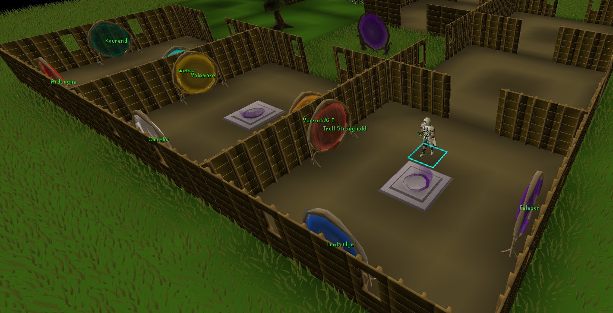

# POH Portal Labels
Adds basic label names to POH portals. When I first created portals I often forgot which portal went where, and for speed I had wished there was a way to see where the portals went without having to hover or right-click. 

Current supported portals by material:

| Portal Material | Location                       |
|-----------------|--------------------------------|
| Teak            | Lumbridge                      |
| Teak            | Varrock/G.E.                   |
| Teak            | Falador                        |
| Teak            | Troll Stronghold               |
| Teak            | Camelot                        |
| Teak            | Valamore (Civitas Illa Fortis) |
| Teak            | Weiss                          |
| Teak            | Ardougne                       |
| Teak            | Kourend                        |

